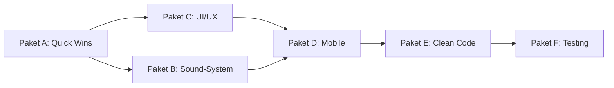

# El Pollo Loco - Checkliste Abarbeitungsplan

## Übersicht: Aktueller Stand vs. Anforderungen

Basierend auf der Analyse des bestehenden Codes und der offiziellen Checkliste (PDF) ergibt sich folgender Handlungsbedarf.

---

## 1. Allgemein

### Git-Workflow
| # | Punkt | Status | Anmerkung |
|---|-------|--------|-----------|
| 1.1 | Commits nach jeder Coding-Session | ✅ | Nicht prüfbar, aber Projektstruktur vorhanden |
| 1.2 | Klare Commit-Messages | ✅ | Siehe `.gitignore` und Projektstruktur |
| 1.3 | `.gitignore` verwenden | ✅ | Existiert |
| 1.4 | Repository gepflegt | ✅ | |

### Funktionalität
| # | Punkt | Status | Details |
|---|-------|--------|---------|
| 2.1 | Keine Konsolenfehler | ⚠️ Teilweise | 2 `console.log`-Aufrufe entfernen |
| 2.2 | Keine `console.log` Ausgaben | ❌ | `js/game.js:39` + `models/world.class.js:102` |

### Design
| # | Punkt | Status | Details |
|---|-------|--------|---------|
| 3.1 | Richtige Schriftart lokal eingebunden | ✅ | `zabars.ttf` via `@font-face` |
| 3.2 | Favicon vorhanden | ❌ | Fehlt komplett |
| 3.3 | `cursor: pointer` auf Buttons | ✅ | `.start-button` hat `cursor: pointer` |

### Responsiveness
| # | Punkt | Status | Details |
|---|-------|--------|---------|
| 4.1 | Desktop + Mobile Querformat | ❌ | Keine Landscape-Erkennung |
| 4.2 | "Turn your Device" im Hochformat | ❌ | Fehlt komplett |
| 4.3 | Mobile-Touch-Buttons nur auf Tablet/Handy | ❌ | Fehlen komplett |
| 4.4 | Kein Scrollbalken bei kleinen Auflösungen | ❌ | `overflow` nicht gesetzt |

---

## 2. Technische Umsetzung & Clean Code

| # | Punkt | Status | Details |
|---|-------|--------|---------|
| 5.1 | Aussagekräftige Dateinamen | ✅ | |
| 5.2 | `index.html` als Hauptseite | ✅ | |
| 5.3 | `classes` Ordnerstruktur | ✅ | `models/` entspricht dem Prinzip |
| 5.4 | Eine Funktion = eine Aufgabe | ⚠️ | Einige Funktionen prüfbar |
| 5.5 | Max 14 Zeilen pro Funktion | ❌ | Mehrere Funktionen länger (z.B. `checkCollisions` ~80 Zeilen) |
| 5.6 | Deutliche Namen, konsistente Schreibweise | ✅ | |
| 5.7 | 1-2 Leerzeilen zwischen Funktionen | ✅ | |
| 5.8 | Max 400 LOCs pro Datei | ⚠️ | `world.class.js` = 352 Zeilen (OK, aber grenzwertig) |
| 5.9 | JSDoc-Dokumentation | ❌ | Fehlt komplett |
| 5.10 | Statischer HTML-Code nicht per JS | ✅ | |

---

## 3. User Stories - Funktionalitäten

### Spielerklärung / Landingpage
| # | Punkt | Status | Details |
|---|-------|--------|---------|
| 6.1 | Hintergrundbild passend zum Thema | ✅ | |
| 6.2 | Schriftart angepasst | ✅ | |
| 6.3 | Tastenbelegung nachschauen | ⚠️ | Ist immer sichtbar, nicht als Dialog |
| 6.4 | Story-Erklärung (optional) | ❌ | Fehlt |
| 6.5 | Fullscreen-Modus (optional) | ❌ | Fehlt |

### Spiel
| # | Punkt | Status | Details |
|---|-------|--------|---------|
| 7.1 | Start-Button | ✅ | |
| 7.2 | Nicht direkt von Gegnern überrannt | ✅ | Character startet links, Gegner weiter rechts |
| 7.3 | Gleichmäßiger Hintergrund ohne Lücken | ⚠️ | Zu prüfen im Spiel |
| 7.4 | Hintergrundmusik + Soundeffekte | ❌ | Fehlt komplett |
| 7.5 | Mute-Button + Local Storage | ❌ | Fehlt komplett |
| 7.6 | Endscreen mit Restart + Zurück zum Home | ❌ | Game Over/Win Screen wird gezeichnet, aber kein Restart-Button |

### Charakter
| # | Punkt | Status | Details |
|---|-------|--------|---------|
| 8.1 | Flüssige Sprunganimation | ✅ | |
| 8.2 | Flüssige Animation generell | ✅ | |
| 8.3 | Idle + Sleep (≤15 Sek.) | ✅ | `IMAGES_IDLE` → `IMAGES_LONG_IDLE` |
| 8.4 | Coins & Flaschen einsammeln | ✅ | |
| 8.5 | Flaschen werfen | ✅ | |
| 8.6 | Sounds zu Animationen | ❌ | Fehlt komplett |
| 8.7 | Statusbar bei Schaden | ✅ | |

### Gegner
| # | Punkt | Status | Details |
|---|-------|--------|---------|
| 9.1 | 2+ Gegnertypen + Endboss | ✅ | Chicken, ChickenSmall, Endboss |
| 9.2 | Endboss stärker als normale Gegner | ✅ | |
| 9.3 | Flüssige Animationen | ✅ | |
| 9.4 | Nur bei Sprung von oben besiegen | ✅ | `isStompCollision()` |
| 9.5 | Offsets passen | ✅ | |
| 9.6 | Sounds zu Animationen | ❌ | Fehlt komplett |

---

## 4. Sonstiges

### User Story 1 - Mobile
| # | Punkt | Status | Details |
|---|-------|--------|---------|
| 10.1 | Querformat auf Mobilgeräten | ❌ | Fehlt |
| 10.2 | Mobile Touch-Buttons | ❌ | Fehlen komplett |
| 10.3 | Kontextmenü deaktiviert | ❌ | Fehlt |
| 10.4 | Hochformat-Meldung | ❌ | Fehlt |

### User Story 2 - Impressum
| # | Punkt | Status | Details |
|---|-------|--------|---------|
| 11.1 | Impressum-Link/Seite | ❌ | Fehlt komplett |
| 11.2 | Keine echten Daten im Impressum | ❌ | |

---

## Arbeitspakete (Todos)

### Paket A: Quick Wins & Cleanup
- [ ] `console.log` in `js/game.js:39` entfernen
- [ ] `console.log` in `models/world.class.js:102` entfernen
- [ ] Favicon (`favicon.ico`) erstellen und in `index.html` einbinden
- [ ] `overflow: hidden` für Body bei kleinen Auflösungen
- [ ] HTML `lang` von "en" auf "de" ändern

### Paket B: Sound-System
- [ ] Sound-Manager-Klasse erstellen (`models/sound-manager.class.js`)
- [ ] Sound-Dateien organisieren (Hintergrundmusik, Jump, Hurt, Throw, Coin, etc.)
- [ ] Mute-Button mit Local Storage-Speicherung
- [ ] Sounds in Character-Animationen integrieren (Jump, Hurt, Death, Snore)
- [ ] Sounds in Gegner-Animationen integrieren (Endboss getroffen, Chicken)
- [ ] Sounds in World-Events integrieren (Coin collected, Bottle thrown, Splash)

### Paket C: UI/UX Verbesserungen
- [ ] Spielerklärungs-Dialog (How-to-Play Overlay)
- [ ] Dialog öffnet/schließt per Button-Klick oder Klick außerhalb
- [ ] Fullscreen-Toggle-Button
- [ ] Endscreen mit "Restart"- und "Zurück zum Home"-Buttons (ohne Page Reload)
- [ ] Restart-Funktion implementieren (World zurücksetzen ohne Reload)
- [ ] Impressum-Seite/-Modal erstellen

### Paket D: Mobile Responsiveness
- [ ] Landscape/Portrait Detection mit CSS Media Queries + JS
- [ ] "Turn your Device" Overlay für Hochformat auf Mobilgeräten
- [ ] Mobile Touch-Buttons (links/rechts/springen/werfen) – nur sichtbar auf Touch-Geräten
- [ ] `touchstart`/`touchend` Events für Keyboard-Klasse
- [ ] Kontextmenü auf Touch-Buttons deaktivieren (`touch-action: none`)
- [ ] CSS-Anpassungen: kein Scrollbar, Canvas-Größe, etc.

### Paket E: Clean Code & Dokumentation
- [ ] JSDoc für alle Klassen und öffentlichen Methoden
- [ ] Große Funktionen auslagern / refactoren (max 14 Zeilen)
- [ ] `checkCollisions()` in `world.class.js` aufteilen
- [ ] Prüfen ob alle Dateien < 400 LOC sind

### Paket F: Testing & Quality
- [ ] Alle Funktionalitäten manuell testen
- [ ] Auf Konsolenfehler prüfen
- [ ] Animation-Geschwindigkeiten prüfen
- [ ] Kollisions-Offsets visuell verifizieren
- [ ] Responsive Design auf verschiedenen Größen testen

---

## Mögliche Reihenfolge der Bearbeitung

**Empfohlene Reihenfolge:** A → B + C (parallel) → D → E → F